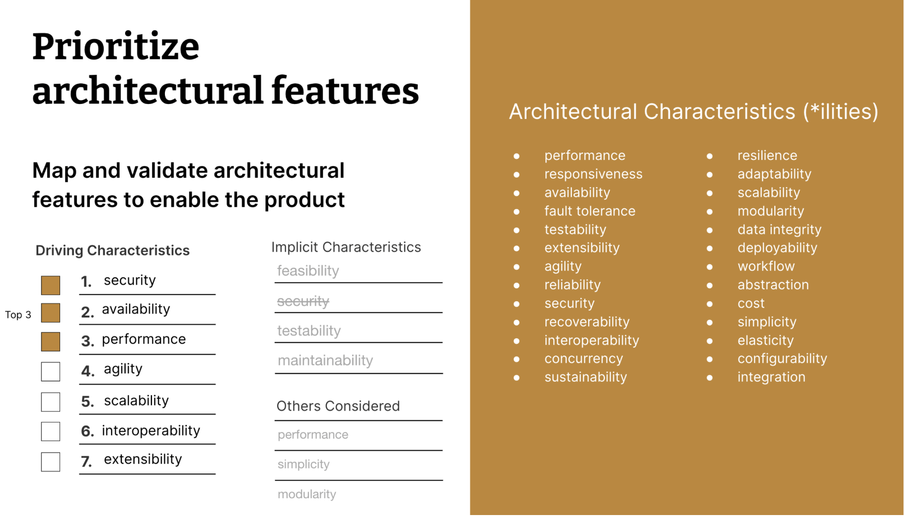

# Non functional requirements and architectural features

_Image from https://www.thoughtworks.com/insights/blog/architecture/architectural-risk-management_

## Security

> Security is a non-functional requirement assuring all data inside the system or its part will be protected against malware attacks or unauthorized access. But there’s a catch. The lion’s share of security non-functional requirements can be translated into concrete functional counterparts. If you want to protect the admin panel from unauthorized access, you would define the login flow and different user roles as system behavior or user actions. [[1]](#altexsoft)

Examples [[2]](#jimmyxu101):

- The software must remain resilient in the face of attacks.
- The behavior of the software must be correct and predictable.
- The software must be available and behave reliably even under - DOS attacks.
- The software must ensure the integrity of the customer account - information.
- The server must not return a restricted web page to any browser - that it cannot authenticate.
- The server must not return a restricted web page to a user who is not authorized to access it.
- The software must not accept overlong input data.
- The application must not accept invalid URLs.
- The software must be built following SOA web service security standards.
- The development processes must comply with SSE-CMM capability level 3 or above.

## Availability

> Availability describes how likely the system is accessible to a user at a given point in time. While it can be expressed as an expected percentage of successful requests, you may also define it as a percentage of time the system is accessible for operation during some time period. For instance, the system may be available 98 percent of the time during a month. Availability is perhaps the most business-critical requirement, but to define it, you also must have estimations for reliability and maintainability. [[1]](#altexsoft)

Examples [[1]](#altexsoft)[[3]](#winatalent)[[4]](#requirements)[[7]](#octoperf):

- The web dashboard must be available to US users 99.98 percent of the time every month during business hours EST.
- Employers can post jobs on the website throughout the week at any time during the day. In the case of unplanned system downtime, all features will be available again after one working day.
- The solution will not be available for normal use or system maintenance purposes for all UK bank holidays, and the Christmas shut down period.
- The application must be able to support a continuous level of availability under levels of normal operating volumes and concurrency, with no application performance degradation over a period of time between planned application restarts,
- The application CPU and Memory consumption must not degrade over a period of time between planned application restarts,
- The application must be available between 7am and 10pm, 7 days a week.

## Perfomance

> Performance defines how fast a software system or a particular piece of it responds to certain users’ actions under a certain workload. In most cases, this metric explains how long a user must wait before the target operation happens (the page renders, a transaction is processed, etc.) given the overall number of users at the moment. But it’s not always like that. Performance requirements may describe background processes invisible to users, e.g. backup. [[1]](#altexsoft)

Examples [[1]](#altexsoft)[[5]](#checkpointech)[[7]](#octoperf):

- The landing page supporting 5,000 users per hour must provide 6 second or less response time in a Chrome desktop browser, including the rendering of text and images and over an LTE connection.
- Application logon must have a 90th percentile of no more than 3,000 milliseconds when executing five concurrent logons and be sustainable for 15 minutes where the load on server resources may not be more than 75 percent on average.
- A REST service call must respond with 500 milliseconds, at the 95th percentile.
- A synchronous database request must respond with 1000 milliseconds, at the 95th percentile.
- A batch process must complete its processing within 60 minutes.

## Agility

> It has become today’s buzzword when describing a contemporary software method. An associate agile team could be a handy team able to befitting reply to changes. Modification is what software development is highly abundant. [[10]](#devgenius)

Examples [[10]](#devgenius):

- How easy it is to apply changes and enhance the system?
- How easily developers and others can test the software?
- To which degree developers can modify the software without introducing defects or degrading existing product quality?
- How easy is the installation of the system on all necessary platforms?
- How quick it is to upgrade from a previous version of this application/solution to a newer version on servers and clients?
- How easily can users change aspects of the software’s configuration?
- To which degree a product, system, or component can exchange information with other products, designs, or members and perform its required functions while sharing the same hardware or software environment?

## Scalability

> Scalability assesses the highest workloads under which the system will still meet the performance requirements. There are two ways to enable your system scale as the workloads get higher: horizontal and vertical scaling. [[1]](#altexsoft)

Examples [[1]](#altexsoft)[[6]](#modernanalyst)[[7]](#octoperf):

- The system must be scalable enough to support 1,000,000 visits at the same time while maintaining optimal performance.
- The solution shall be able to support an annual growth of 10% of new customers.
- The solution shall be able to support an annual growth of 15% on the number of transactions.
- The application must be able to support an annual transactional growth rate of 10%, and still meet all defined transactional performance requirements,
- The database must be able to an annual growth rate of 20%, with no degradation in database performance,
- The application must be able to support a 10% growth in user concurrency, and still meet all defined transactional performance requirements.

## Interoperability

Can be divided between four categories, according to [[8]](#argondigital):

- **Hardware Interoperability**: What hardware must connect to the system? Does the software need to run on different types of devices (mobile vs. PC)? How about different types of equipment (ex. “system must be backwards compatible with credit card machines generation 1.001-3.003”)?

- **Information Interoperability**: How easily must information move from one system to another? Must it be seamless and on demand, or can information be shared on a scheduled basis? Must the applications share the same data format or can an ETL process be used?

- **Technical Interoperability**: How are other technical services shared? Determining these requirements is important, because applications are often maintained differently in a development environment than in a production one. For example, can application A and B share the same server, or does “A” require its own due to special technical circumstances?

- **Business Interoperability**: What business processes are shared? If both payroll accounting and cost accounting use different software (yes, this exists), and both must access employee timecard information, then that highlights potential information interoperability requirements.

## Extensibility

> Extensibility is the ability of the software system to allow and accept the significant extension of its capabilities without major rewriting of code or changes in its basic architecture. Extensible systems provide technology, tools, languages designed so that developers can expand or add to their capabilities. [[9]](#peerspot)

According to [[9]](#peerspot) there are 11 attributes of extensible and consumable software:

1. One can set up a new account (or, if on-prem, one can install the product) in 30 minutes or less.
2. The value is seen within the first hour of use.
3. Full external-facing API.
4. The product’s UI uses the user-facing API exclusively. In other words, the UI does not depend on any API calls or interfaces that are not documented and available to customers.
5. Authentication is customizable within the product’s UI.
6. The UI has a customizable look & feel.
7. The UI can be extended with custom modules.
8. Backend logic that can be extended with custom modules in various hook points.
9. Customizations & extensions are upgrade-safe.
10. Full documentation and support for the API, extension framework, and hook points.
11. A rich library of readily available examples of extensibility.

## References

[1] <a id="altexsoft" href="https://www.altexsoft.com/blog/non-functional-requirements/">https://www.altexsoft.com/blog/non-functional-requirements/</a>

[2] <a id="jimmyxu101" href="https://sites.google.com/site/jimmyxu101/requirements/categories-of-security-requirements">https://sites.google.com/site/jimmyxu101/requirements/categories-of-security-requirements</a>

[3] <a id="winatalent" href="https://winatalent.com/blog/2020/05/what-are-non-functional-requirements-types-and-examples/">https://winatalent.com/blog/2020/05/what-are-non-functional-requirements-types-and-examples/</a>

[4] <a id="requirements" href="https://requirements.com/Content/What-is/what-are-availability-requirements">https://requirements.com/Content/What-is/what-are-availability-requirements</a>

[5] <a id="checkpointech" href="https://checkpointech.com/what-performance-requirements/">https://checkpointech.com/what-performance-requirements/</a>

[6] <a id="modernanalyst" href="https://www.modernanalyst.com/Resources/Articles/tabid/115/ID/4968/Non-Functional-Requirements-Scalability.aspx">https://www.modernanalyst.com/Resources/Articles/tabid/115/ID/4968/Non-Functional-Requirements-Scalability.aspx</a>

[7] <a id="octoperf" href="https://octoperf.com/blog/2019/06/26/non-functional-requirements">https://octoperf.com/blog/2019/06/26/non-functional-requirements</a>

[8] <a id="argondigital" href="https://argondigital.com/blog/product-management/non-functional-requirements-interoperability-requirements/">https://argondigital.com/blog/product-management/non-functional-requirements-interoperability-requirements/</a>

[9] <a id="peerspot" href="https://www.peerspot.com/articles/software-extensibility-definition-attributes-and-techniques">https://www.peerspot.com/articles/software-extensibility-definition-attributes-and-techniques</a>

[10] <a id="devgenius" href="https://blog.devgenius.io/top-10-architecture-characteristics-non-functional-requirements-with-cheatsheat-7ad14bbb0a9b">https://blog.devgenius.io/top-10-architecture-characteristics-non-functional-requirements-with-cheatsheat-7ad14bbb0a9b</a>
